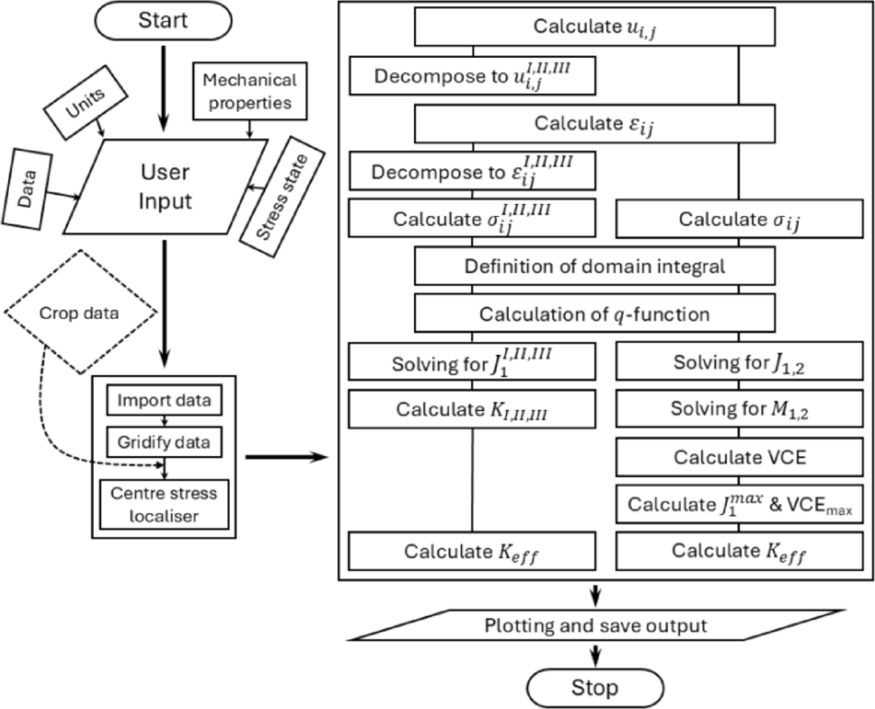
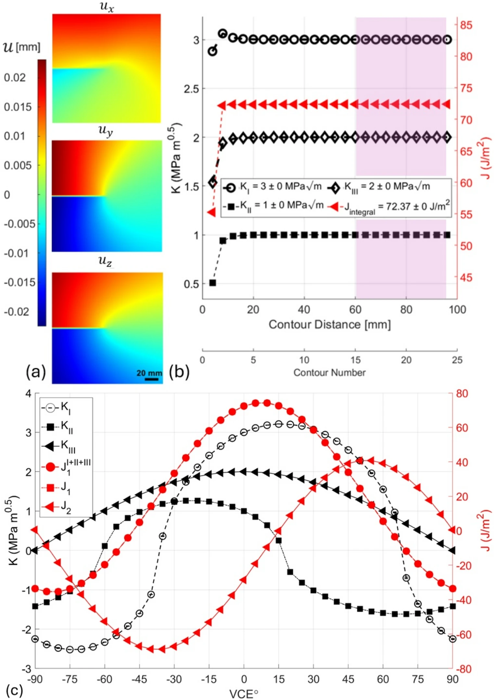
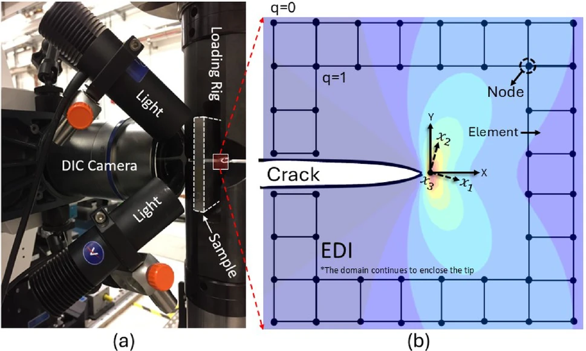
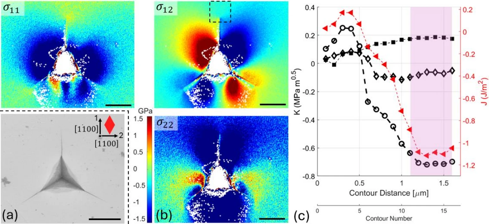
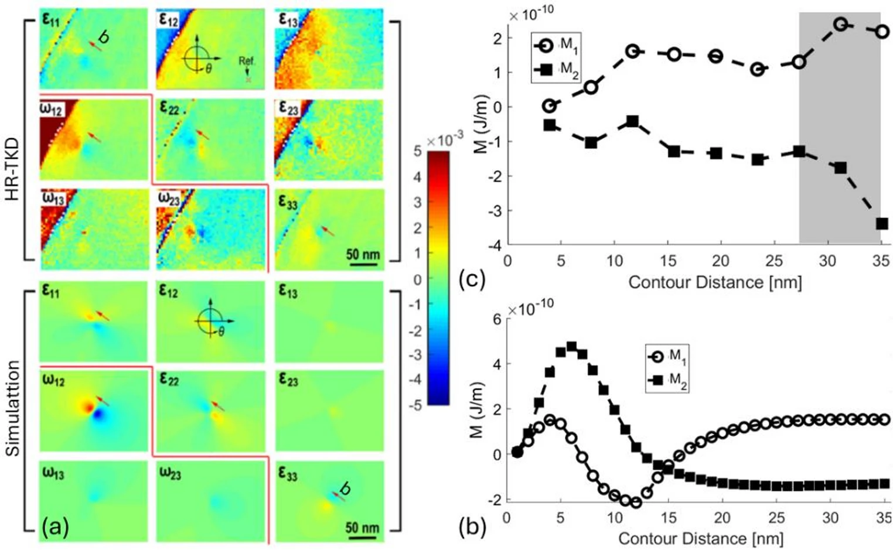
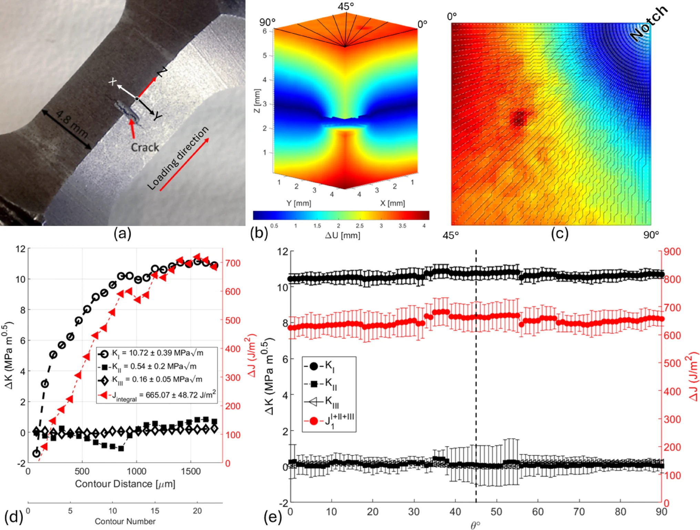

# Defect Descriptor

<p align="center">
  <strong>Configurational-force and mixed-mode defect descriptors directly from experimental field maps.</strong>
</p>

<p align="center">
  <a href="https://github.com/Shi2oon/Defect_Descriptor/blob/main/LICENSE"></a>
  
  <a href="https://doi.org/10.1007/s00366-025-02262-5"></a>
  
</p>

**Defect Descriptor** is a MATLAB toolbox for extracting local mechanical descriptors from measured or synthetic displacement, displacement-gradient, deformation-gradient, and strain maps. It calculates configurational-force quantities and mixed-mode stress intensity factors directly from field data, without requiring a standard specimen geometry, a known applied load, or a predefined finite-element boundary-value problem.

The toolbox is intended for cracks, dislocations, microcracks, fatigue cracks, and other localised defect fields where the useful information is already present in the measured map.

<p align="center">
  
</p>

<p align="center">
  <em>Computational workflow for field import, preprocessing, integral calculation, mode decomposition, and output generation.</em>
</p>

---

## What the toolbox gives you

| Output | Meaning | Typical use |
|---|---|---|
| J | Energy-release/configurational-force integral | Crack-driving force and contour convergence checks |
| M | Configurational-force descriptor | Directional defect force and defect-severity analysis |
| K<sub>I</sub> | Mode-I stress intensity factor | Opening or closing at the crack/defect field |
| K<sub>II</sub> | Mode-II stress intensity factor | In-plane shear contribution |
| K<sub>III</sub> | Mode-III stress intensity factor | Out-of-plane or anti-plane shear contribution, where supported by the input field |
| J<sub>1</sub>, J<sub>2</sub> | Vectorial components of the J-integral | Directional crack-driving force |
| M<sub>1</sub>, M<sub>2</sub> | Vectorial components of the M-integral | Directional configurational-force descriptor |
| Direction sweep | J, M, K<sub>I</sub>, K<sub>II</sub>, and K<sub>III</sub> over trial directions | Finding the maximum-energy virtual crack extension direction |

The main solver is:

```matlab
[K, KI, KII, KIII, J, M, Maps] = M_J_KIII_2D(Data, Prop);
```

The returned structures contain the converged values, contour/domain-wise raw values, standard deviations, and plotting data used to judge convergence.

---

## Why this matters

Conventional fracture-mechanics calculations are clean when the geometry, crack path, loading, and boundary conditions are known. Real experimental data are rarely that clean.

Defect Descriptor starts from the measured field itself. It is useful when you want to:

- calculate J, M, K<sub>I</sub>, K<sub>II</sub>, and K<sub>III</sub> from local field maps;
- analyse non-standard cracks, curved crack fronts, microcracks, dislocations, or defect clusters;
- work with DIC, stereo-DIC, DVC, HR-EBSD, HR-TKD, or synthetic validation fields;
- avoid relying on idealised specimen solutions when the real boundary conditions are unknown;
- test how the assumed virtual crack extension direction changes the extracted fracture descriptors.

The method is powerful, but not magic. It extracts meaningful quantities only when the input field is physically meaningful, sufficiently resolved, correctly scaled, and centred around the defect.

---

## Repository structure

```text
Defect_Descriptor/
├── Data/                         # Example datasets and README figures
│   ├── 366_2025_2262_Fig1_HTML.webp
│   ├── 366_2025_2262_Fig2_HTML.png
│   ├── 366_2025_2262_Fig3_HTML.webp
│   ├── 366_2025_2262_Fig4_HTML.webp
│   ├── 366_2025_2262_Fig5_HTML.webp
│   └── 366_2025_2262_Fig6_HTML.webp
├── functions/                    # Core MATLAB routines
├── input_desk_Validation.m       # Synthetic-field validation examples
├── input_desk_DIC.m              # 2D DIC, stereo-DIC, and elastoplastic examples
├── input_desk_xEBSD.m            # HR-EBSD/xEBSD example workflow
├── input_Direction_Sweep.m       # Direction sweep over trial VCE angles
├── LICENSE                       # MIT licence
└── README.md
```

---

## Quick start

Clone the repository and run MATLAB from the repository root:

```matlab
clc; clear; close all
addpath(genpath(fullfile(pwd, 'functions')));
```

Then choose the input desk that matches your data type.

| Input desk | Use it for |
|---|---|
| `input_desk_Validation.m` | Synthetic fields with known K<sub>I</sub>, K<sub>II</sub>, and K<sub>III</sub> |
| `input_desk_DIC.m` | 2D DIC, stereo-DIC, displacement maps, and elastoplastic examples |
| `input_desk_xEBSD.m` | HR-EBSD/xEBSD displacement-gradient or strain-gradient workflows |
| `input_Direction_Sweep.m` | VCE-angle sweep from negative to positive trial directions |

---

## Example 1: validate the code with a synthetic mixed-mode field

Start here before using experimental data. The validation desk generates a known mixed-mode field and checks whether the toolbox recovers the prescribed values.

```matlab
clc; clear; close all
addpath(genpath(fullfile(pwd, 'functions')));

% Generate synthetic field with known mixed-mode input:
% KI = 3, KII = 1, KIII = 2
[~, ~, alldata, Prop] = Calibration_2DKIII(3, 1, 2);

% U means displacement-gradient input
Prop.Operation = 'U';

[K, KI, KII, KIII, J, M, Maps] = M_J_KIII_2D(alldata, Prop);
```

<p align="center">
  
</p>

<p align="center">
  <em>Synthetic mixed-mode validation: displacement fields, convergence of K<sub>I</sub>, K<sub>II</sub>, K<sub>III</sub>, and sensitivity to virtual crack extension direction.</em>
</p>

Use this workflow to test installation, paths, units, and the expected data layout before introducing experimental noise.

---

## Example 2: DIC or stereo-DIC displacement fields

Use `input_desk_DIC.m` for measured displacement maps.

```matlab
clc; clear; close all
addpath(genpath(fullfile(pwd, 'functions')));

Prop.E = 210e9;                   % Young's modulus [Pa]
Prop.nu = 0.30;                   % Poisson's ratio [-]
Prop.units.St = 'Pa';             % Stress unit
Prop.units.xy = 'mm';             % Coordinate unit: 'm', 'mm', 'um', or 'nm'
Prop.stressstat = 'plane_stress'; % 'plane_stress' or 'plane_strain'
Prop.Operation = 'DIC';           % Raw DIC or stereo-DIC displacement data

DataDirect = fullfile(pwd, 'Data', '1KI-2KII-3KII_Data.dat');
Data = importdata(DataDirect);

[K, KI, KII, KIII, J, M, Maps] = M_J_KIII_2D(Data.data, Prop);
```

For elastoplastic behaviour, define the additional Ramberg-Osgood-type parameters before calling the solver:

```matlab
Prop.E = 210e9;
Prop.nu = 0.30;
Prop.yield = 4e9;          % Yield stress [Pa]
Prop.Yield_offset = 1.24;  % Hardening coefficient
Prop.Exponent = 26.67;     % Hardening exponent
Prop.units.St = 'Pa';
Prop.units.xy = 'm';
Prop.stressstat = 'plane_stress';
Prop.Operation = 'DIC';
```

<p align="center">
  
</p>

<p align="center">
  <em>DIC measurement and equivalent domain integration concept around a crack tip.</em>
</p>

---

## Example 3: HR-EBSD or xEBSD maps

Use `input_desk_xEBSD.m` when the field has been prepared through an xEBSD-style workflow.

```matlab
clc; clear; close all
addpath(genpath(fullfile(pwd, 'functions')));

filename = fullfile(pwd, 'Data', 'Crack_in_Si_XEBSD');

[Maps, alldata] = GetGrainData(filename);
M_J_KIII_2D(alldata, Maps);
```

For CrossCourt or other HR-EBSD pipelines, prepare the data into the same column structure expected by the solver. The example is a useful template, not a universal importer for every HR-EBSD output format.

<p align="center">
  
</p>

<p align="center">
  <em>Example HR-EBSD application to an indentation-induced microcrack, including stress maps and convergence of J and SIFs.</em>
</p>

---

## Example 4: dislocation and M-integral analysis

For dislocations or other defect fields where the goal is not only crack-tip fracture but configurational-force characterisation, the toolbox can be used to evaluate M<sub>1</sub> and M<sub>2</sub> from measured or simulated displacement-gradient fields.

<p align="center">
  
</p>

<p align="center">
  <em>Application to experimental and simulated dislocation fields in anisotropic tungsten, showing M-integral convergence.</em>
</p>

---

## Example 5: direction sweep

`input_Direction_Sweep.m` rotates the local tensor field over a range of trial angles and recalculates the descriptors at each angle.

```matlab
crack_angles = -90:1:90;

for i = 1:length(crack_angles)
    theta = crack_angles(i);

    R = [cosd(theta) -sind(theta) 0;
         sind(theta)  cosd(theta) 0;
         0            0           1];

    % Rotate the local tensor field before solving
    % RotatedAlldata = ...

    [K, KI, KII, KIII, J, M] = M_J_KIII_2D(RotatedAlldata, Prop);
end
```

Typical sweep outputs include:

| Column | Meaning |
|---|---|
| `Theta_deg` | Trial virtual crack extension angle |
| `J_J_per_m2` | Scalar J value |
| `KI_MPa_sqrt_m` | Mode-I stress intensity factor |
| `KII_MPa_sqrt_m` | Mode-II stress intensity factor |
| `KIII_MPa_sqrt_m` | Mode-III stress intensity factor |
| `J1_J_per_m2`, `J2_J_per_m2` | Vectorial J components |
| `M1_J_per_m`, `M2_J_per_m` | Vectorial M components |

Use this workflow when the crack or defect direction is uncertain, when the local field suggests kinking, or when the maximum-energy direction is part of the scientific question.

---

## Example 6: 3D displacement fields and curved crack fronts

The toolbox can also be used with 3D displacement fields, for example fields obtained from digital volume correlation of X-ray computed tomography data. This is useful for fatigue cracks with complicated crack-front geometry.

<p align="center">
  
</p>

<p align="center">
  <em>DVC-based fatigue-crack example showing 3D displacement data, contour convergence, and virtual crack extension angle sweep.</em>
</p>

---

## Input formats

The solver accepts several forms of local field data. The most common layouts are listed below.

### DIC displacement data

For 2D DIC:

```text
X   Y   Ux   Uy
```

For stereo-DIC or 3D surface displacement:

```text
X   Y   Z   Ux   Uy   Uz
```

### Displacement-gradient or deformation-gradient data

For gradient-based input, arrange the data as:

```text
X   Y   Z   G11   G12   G13   G21   G22   G23   G31   G32   G33
```

where `Gij` is either the displacement-gradient component or the deformation-gradient component depending on `Prop.Operation`.

### Operation modes

| `Prop.Operation` | Input meaning | Typical source |
|---|---|---|
| `'DIC'` | Displacement field | 2D DIC, stereo-DIC, DVC slices, synthetic displacement maps |
| `'U'` | Displacement-gradient field | Synthetic validation, HR-EBSD-style prepared data |
| `'F'` | Deformation-gradient field | Deformation-gradient maps |

---

## Required assumptions and data checks

This section is deliberately strict. Most wrong results come from violating one of these points.

### Geometry and grid

Your map should be:

- **square**, with the same number of points in X and Y;
- **uniformly spaced**, with equal spacing in X and Y;
- **centred**, with the crack tip, dislocation core, or defect centre at the centre of the analysis window;
- **large enough**, so that the expanding integration domain can reach a converged region;
- **cleaned**, with crack faces, holes, grain-boundary artefacts, or missing measurements handled consistently.

### Units

Use compatible units throughout the analysis.

| Quantity | Recommended unit |
|---|---|
| Stress | Pa |
| Elastic modulus | Pa |
| Coordinates | Declare explicitly through `Prop.units.xy` |
| Displacements | Consistent with coordinate units |
| J | J/m² |
| M | J/m |
| K | MPa√m in reported plots/tables, depending on conversion inside the workflow |

Do not mix metres, millimetres, micrometres, nanometres, Pa, and MPa casually. That is the fastest way to get a beautiful but meaningless plot.

### Material behaviour

The current workflows support:

- isotropic elastic material properties through `Prop.E` and `Prop.nu`;
- anisotropic stiffness input where prepared in the relevant workflow;
- elastoplastic behaviour through Ramberg-Osgood-type parameters in the DIC workflow.

The implementation is most appropriate for small-strain mechanics. Do not treat it as a finite-deformation hyperelastic toolbox without extending the formulation.

---

## How to interpret convergence

The code expands the integration domain away from the defect and reports descriptor values as a function of contour or domain size. A useful result normally shows a stable region after the highly localised near-tip field has been excluded and before the domain reaches unrelated boundaries or neighbouring defects.

A sensible workflow is:

1. Run the solver.
2. Inspect the raw contour/domain sequence.
3. Exclude the first contours if they are dominated by singularity, noise, or missing data.
4. Exclude later contours if they interact with boundaries, grain boundaries, other cracks, or surrounding defects.
5. Report the mean and standard deviation over the stable region only.

If there is no stable region, the result is not trustworthy. Do not rescue it by averaging everything.

---

## Common problems

| Problem | Likely cause | What to check |
|---|---|---|
| J or K values are orders of magnitude wrong | Unit mismatch | `Prop.units.xy`, stress units, modulus units, displacement units |
| No stable convergence region | Field of view too small or neighbouring defects included | Crop differently or increase the measured region |
| Strong oscillation in K<sub>II</sub> or K<sub>III</sub> | Noisy gradient field or incorrect VCE direction | Smooth cautiously, verify coordinate frame, run a direction sweep |
| Negative K<sub>I</sub> | Crack field is locally closing rather than opening | Check load state, residual stress, unloading condition, and sign convention |
| xEBSD example does not run | `GetGrainData` not on path or data not prepared in expected format | Add the required xEBSD helper functions and check the data structure |
| Pretty figure but physically absurd values | Input field is not mechanically consistent | Check centring, rigid-body motion, filtering, cracks/faces, and boundary artefacts |

---

## Recommended workflow for a new dataset

```text
1. Prepare the field map
   - remove obvious artefacts
   - correct rigid-body motion where needed
   - mask crack faces or missing data consistently

2. Regularise the map
   - square analysis window
   - equal X and Y spacing
   - defect centred in the field of view

3. Choose input mode
   - DIC for displacement maps
   - U for displacement-gradient maps
   - F for deformation-gradient maps

4. Define material and units
   - E, nu, or stiffness matrix
   - plane stress or plane strain
   - coordinate and stress units

5. Run M_J_KIII_2D

6. Inspect convergence
   - choose the stable contour/domain region
   - report mean and standard deviation

7. Optional direction sweep
   - rotate the VCE direction
   - identify maximum J or physically preferred propagation direction
```

---

## Citation

If you use this toolbox, please cite:

```bibtex
@article{Koko2026DefectDescriptor,
  title   = {Bridging experiments and defects' mechanics: a data-driven toolbox for configurational force analysis},
  author  = {Koko, Abdalrhaman and Abdelnour, Alya and Becker, Thorsten H. and Marrow, T. James},
  journal = {Engineering with Computers},
  volume  = {42},
  pages   = {21},
  year    = {2026},
  doi     = {10.1007/s00366-025-02262-5}
}
```

Paper: <https://doi.org/10.1007/s00366-025-02262-5>

---

## Figure attribution

Figures in `Data/366_2025_2262_Fig*_HTML.*` are from:

> Koko, A., Abdelnour, A., Becker, T. H. & Marrow, T. J. **Bridging experiments and defects' mechanics: a data-driven toolbox for configurational force analysis.** *Engineering with Computers* 42, 21 (2026). <https://doi.org/10.1007/s00366-025-02262-5>

The article is distributed under the Creative Commons Attribution 4.0 International License. If you reuse or adapt the figures, credit the original authors, cite the article, link the licence, and indicate whether changes were made.

---

## License

This repository is released under the MIT License. See [`LICENSE`](LICENSE).

---

## Contributing

Contributions are welcome, especially for:

- clearer input-data converters for CrossCourt, xEBSD, DVC, and other field-measurement pipelines;
- improved plotting and output tables;
- additional benchmark cases;
- uncertainty propagation for noisy experimental maps;
- finite-deformation extensions beyond the current small-strain implementation.

Before opening a pull request, test the validation desk and include a short description of the dataset, units, material model, and expected output.
